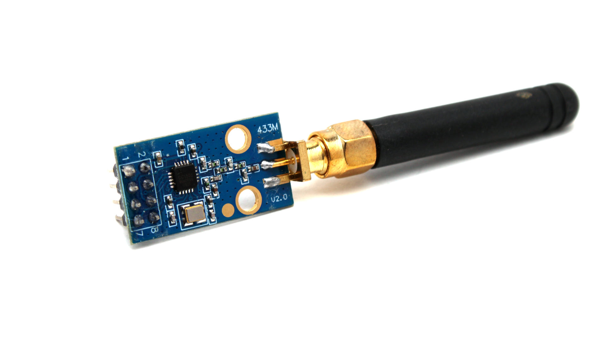

# CatHack Firmware for M5StickCPlus2

## 🎉 Version 1.4 is Out!

I am thrilled to announce the release of **CatHack v1.4**! This update brings exciting new features and improvements to enhance your experience. Here's what's new in this version:

- **Universal Remote**: Control any TV in the world with this comprehensive remote control feature ⚠️hold the button on the right to exit to the menu⚠️
- **New Others Menu** with:
  - **Catgotchi**: Your virtual pet that levels up as you use CatHack features
  - **Lucky 7**: A casino-style game to pass the time
- **Enhanced Settings**:
  - **ScreenSaver**: Choose between an image or black screen
  - **Reset Catgotchi**: Reset your virtual pet (Warning: A new name will be randomly assigned)
  - **IR Pin**: Select the IR LED pin
- Various bug fixes and improvements

Plus all the great features from previous versions:
- **Deauther**: A powerful WiFi deauthentication tool for network testing
- **WiFi Spam**: Capability to flood the area with fake WiFi networks
- **Brightness Control**: Adjust the screen brightness for optimal visibility
- **RF Analyzer**: A powerful tool to identify and analyze the frequency of your SubGhz devices
- **BLE Spam**: Spam advertising packets over Bluetooth Low Energy
- **Bad Portal**: Create fake login pages for security testing
- **Web Interface**: Easily add or remove files through a network interface

CatHack continues to evolve, and I'm committed to providing you with the best tools for your M5StickCPlus2.

## 📸 Device Setup

  
  

Check out the [3D model of my setup](https://www.tinkercad.com/things/jU8COj6wvHs-copy-of-m5cat-plus-2-lego) for a detailed view!

Model made by [STP | MFTEN](https://www.tinkercad.com/things/6C5WqbT3iW9-m5cat-plus-2-lego?sharecode=Xh-GteGc18yoXvBrgn3utlEWV8_2JhlV2xhRgVijvh4)

## ❗Please read the installation instructions carefully❗

## 🚀 Features

### 📺 Infrared Menu
- **TVBGone**: Turn off all nearby televisions with a single click
- **Universal Remote**: Control any TV worldwide with comprehensive remote control features

### 📡 SubGhz Menu
- **SubSend**: Transmit .sub files from Flipper Zero using the CC1101 module (currently supports RAW protocol).
- **SubRecord**: Capture signals from devices using the CC1101 module and save them to an SD card.
- **Jammer**: Disrupt selected frequencies.
- **Monitor**: Visualize received signals in real-time.
- **RF Analyzer**: Identify and analyze the frequency of your SubGhz devices.

### 🌐 WiFi Menu
- **Wardriving**: Collect and log information about nearby networks.
- **Bad Portal**: Create fake login pages for security testing.
- **Web Interface**: Network interface for adding/removing files.
- **Deauther**: Perform WiFi deauthentication attacks for network testing.
- **WiFi Spam**: Generate multiple fake WiFi networks to flood the area.

### 🦷 Bluetooth Menu
- **Skim Check**: Detect potential credit card skimmers in your vicinity.
- **BLE Spam**: Spam advertising packets over Bluetooth Low Energy.

### 🎮 Others Menu
- **Catgotchi**: Virtual pet that gains levels as you use CatHack features
- **Lucky 7**: Casino-style game for entertainment

### ⚙️ Settings Menu
- **Set Frequency**: Configure the frequency for SubRecord, Monitor, Jammer, and RF Analyzer functionalities
- **Set Brightness**: Adjust the screen brightness for optimal visibility
- **ScreenSaver**: Choose between an image or black screen
- **Reset Catgotchi**: Reset your virtual pet (Warning: Generates a new random name)
- **IR Pin**: Configure the IR LED pin

## 🐬 Flipper Zero Compatibility
CatHack supports .sub files with RAW protocol from Flipper Zero. All necessary files, including compatible Flipper Zero files, are included in the [CatFiles.zip](https://drive.google.com/file/d/1RKXt6-wOJWU3LxkXymQJNm4udPsosoiT/view?usp=sharing) package. Simply download and extract these files to your SD card to use them with CatHack.

## 🔮 Planned Future Features
- **IR Send**: Send recorded IR codes or codes from Flipper Zero.
- **IR Record**: Record IR codes.
- **NFC/RFID Read**: Read NFC/RFID tags and save data to SD card.
- **NFC/RFID Emulate**: Emulate NFC/RFID tags using saved data.

## 🛠️ Required Components
- Curved pin headers
  
- CC1101 module
  
- Compact micro SD card module
  
- Double-Sided Prototype Board (3x7cm recommended)
  
- Soldering iron and proficiency in soldering

While it's possible to connect components using cables, soldering is recommended for a more reliable and compact setup.

## 📊 Pinout Diagram

| M5StickCPlus2      | CC1101 | SD Card Module |
|:------------------:|:------:|:--------------:|
| GND                | GND    | GND and CS     |
| G26                | CSN    | MOSI           |
| G36/G25            | GDO0   | MISO           |
| G0                 | SCK    | CLK            |
| 3v3                | Vcc    | 3v3            |
| G32 (bottom pin)   | MOSI   | -              |
| G33 (bottom pin)   | MISO   | -              |

⚠️ Remember to connect CS to GND on the SD card module, otherwise it will not work. ⚠️

## 📥 Installation Guide
1. Download and flash the firmware using M5Burner.
2. Download the [CatFiles.zip](https://drive.google.com/file/d/1RKXt6-wOJWU3LxkXymQJNm4udPsosoiT/view?usp=sharing) and extract its contents to your SD card, it should look like this:

   ⚠️ Note: Some files may not be compatible as only the RAW protocol is currently supported. ⚠️

3. Insert the SD card into the module, and you're ready to go!

## 🌐 Web Interface Login
The default login credentials for the Web Portal are as follows:

**Login**: `cath`  
**Password**: `cath`

## 📱 Media
Stay updated with CatHack through various media channels:

- **Reddit Posts**: Check out my latest updates and discussions on [Reddit](https://www.reddit.com/user/Stachu1134/)
- **YouTube Video**: Watch the CatHack in action: [CatHack Video](https://youtu.be/UGI_UZwbe0s?si=uOVqKbpcL1EUcegq)
- **Instagram Feature**: CatHack was featured by M5Stack on their [Instagram](https://www.instagram.com/p/C-9FTYPBu99/?img_index=1)

## How I Did It

## 📞 Support
If you have any questions or suggestions, feel free to reach out:
- Discord: stachu0

## ❓ Troubleshooting

Why isn't signal recording working?

1. **Incorrect connections**: Double-check your wiring and connections between the components.
2. **Using M5 Launcher**: Ensure that you're running the CatHack firmware directly, not by using m5launcher.
3. **Missing files on the SD card**: Ensure you've added all required files to the SD card. Refer to the installation guide for details on what should be included. 

why doesn't tvbgone/universal remote work?
1. **Incorrect IR pin**: go to settings->ir pin and set it to default

## ⚠️ Disclaimer
This software is intended for educational and research purposes only. The author bears no responsibility for any misuse of this software. Use it responsibly and in compliance with all applicable laws and regulations.

---
🐱 Happy Hacking with CatHack! 🐱
